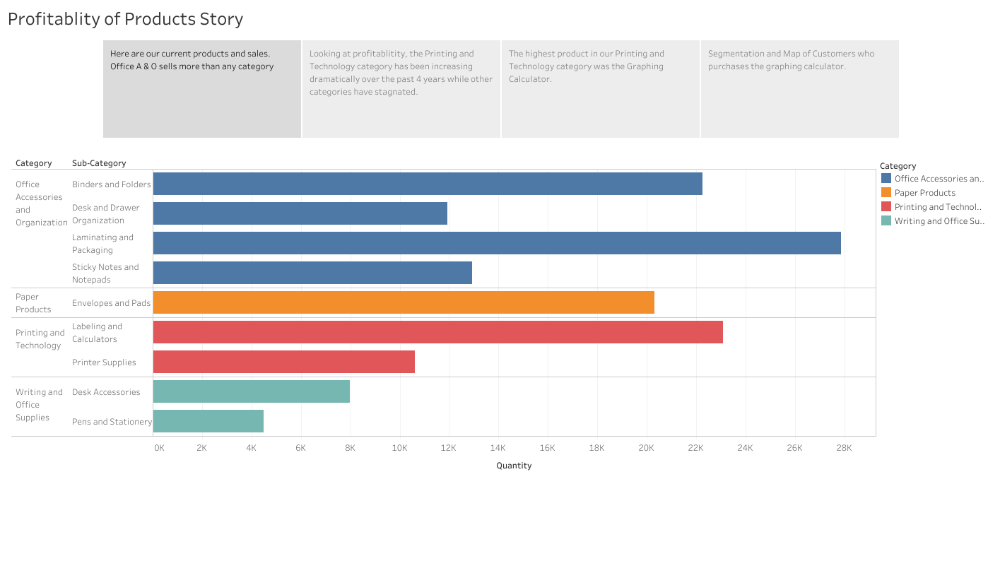
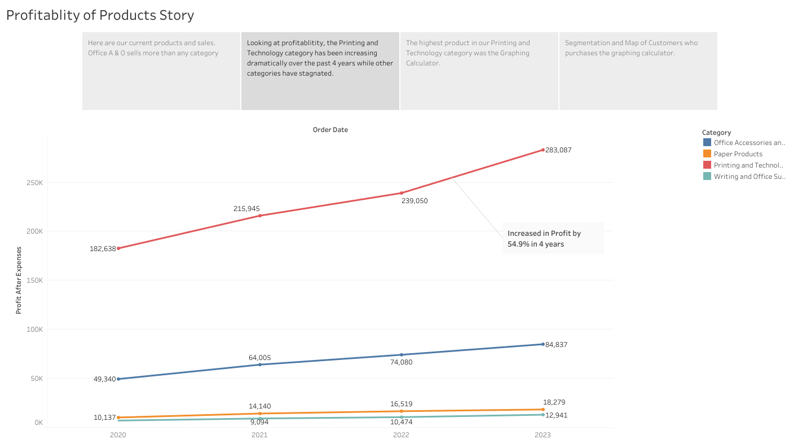
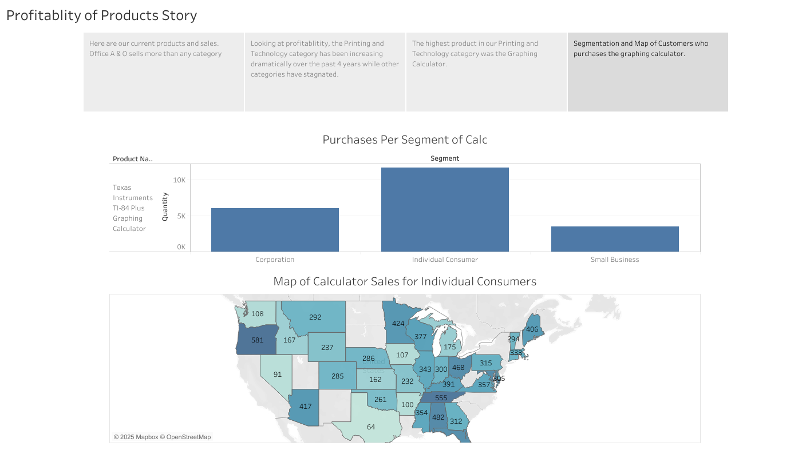

# Office Store Performance Dashboard

This project explores the sales trends and profitability of office products over the past four years using Tableau. Through visualizations, we analyze product categories, subcategories, and customer purchase trends to uncover valuable insights.

## Overview
In this Tableau story, multiple visualizations are used to examine:
- The top-selling office product categories
- The profitability of each product category
- Detailed analysis of the printing and technology categories
- The highest-selling products in those categories (graphing calculators)
- Geographic segmentation of graphing calculator buyers across the US

## Visualizations
1. **Top-Selling Office Product Categories**
   
   - A horizontal bar chart visualizing the most sold product categories in the office supplies market.

2. **Product Category Profitability**
   
   - A line chart illustrating the profitability of each product category over the past four years. The analysis highlights that printing and technology categories have experienced significant growth while others have stagnated.

3. **Printing & Technology Subcategory Analysis**
   
   - A detailed view of the printing and technology categories, showing that graphing calculators were the highest-selling product in these categories.

4. **Graphing Calculator Purchaser Segmentation**
   
   - A bar chart segmented by customer demographics or purchasing behavior.
   - A symbol map displaying the purchase concentration of graphing calculators by state in the US, allowing for geographic insights into product popularity.

## Insights
- **Growth Trends:** Printing and technology products have seen dramatic increases in sales over the last four years, outpacing other office product categories.
- **Top Product:** Graphing calculators are the highest-selling product in the printing and technology categories.
- **Geographic Trends:** Purchase concentration of graphing calculators varies across different states, with some areas showing significantly higher purchase rates than others.

## Technologies Used
- **Tableau:** For creating interactive and insightful visualizations.

## Getting Started
To view the Tableau story, you can check out the live visualization on [Tableau Public](https://public.tableau.com/app/profile/randy.bartolon.barrios6073/viz/ProfitablityofProducts/ProfitablityofProductsStory) or download the Tableau workbook from this repository.
